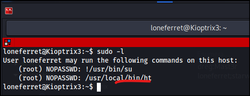

# Escalada de privilegios

En la escalada de privilegios hay muchas técnicas a tener en cuenta. Se añadirán las que se vayan usando. Se supone que ya hemos comprometido una máquina.

## Buscar ficheros **config** o **backup**

Sobre todo si estamos en un directorio de aplicación php, podemos buscar por el patrón config. Es posible obtener donde se configura la aplicación con el usuario de base de datos.

```bash
# Desde el directorio actual
find . -name *config*
# todo el sistema
find / -name *config*
```

También se puede hacer lo mismo con la palabra buckup, buscando posibles zips.

## Revisar los permisos sudo

Si tenemos la contraseña del usuario, podemos ver si tiene permisos sudo con **sudo -l**. Podemos ver si nos podemos aprovechar de algún permiso sudo para escalar privilegios.


