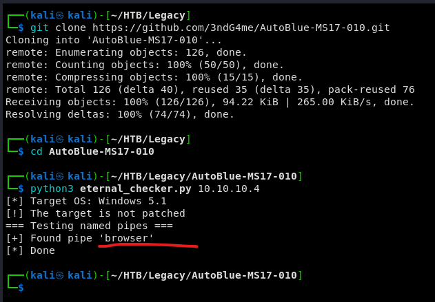

# Legacy

Máquina **Legacy** de dificultad **Easy**.


## Enumeración

Primeramente realizamos un escaneo nmap rápido para averiguar los puertos abiertos.

```
sudo nmap -p- --open -sS --min-rate 5000 -vvv -n -Pn 10.10.10.4 -oG allPorts
```


Vemos que tenemos abiertos los puertos 135, 139, 445. Realizamos ahora un escaneo mas completo a estos puertos para averiguar versiones y demás.&#x20;

```
sudo nmap -sCV -p135,139,445 10.10.10.4 -oN targeted
```


Vemos que nos dice que es un Windows XP. como solo tenemos samba vamos a ver si encuentra vulnerabilidades conocidas.

```
nmap --script "vuln and safe" -p445 10.10.10.4 -oN smbScan
```


Vemos que nos encuentra la famosa vulnerabilidad MS17-010, **Eternal Blue**.

## Explotación

Buscamos en google posibles exploit de esta vulnerabilidad.


Vemos que la primera opción, **AutoBlue**, es en python3.&#x20;


Nos descargamos el exploit y lanzamos el checker para verificar si es vulnerable.



Vemos que es vulnerable. Nos abrimos el fichero zzz\_exploit.py y lo modificamos para crearnos una reverse shell.


Le decimos que ejecute nc.exe, que se encuentra en nuestra maquina en un recurso compartido llamado smbFolder y nos ejecute la shell inversa.

Ahora hay que hacer 3 cosas:

Primero localizar el fichero nc.exe y crear un recurso compartido con impacket-smbserver:

```
impacket-smbserver smbFolder $(pwd) -smb2support
```

Luego ponernos a la escucha por el puerto 443.

```
sudo rlwrap nc -nlvp 443
```

Y por último lanzar el exploit


Vemos abajo a la izquierda que hemos comprometido la máquina. La maquina es muy limitada y no nos da comandos como **whoami** o **id**. Pero hemos entrado com permisos de administrador ya que nos permite leer ambas flags por lo que no es necesario escalar privilegios.


Y damos la máquina por terminada.
